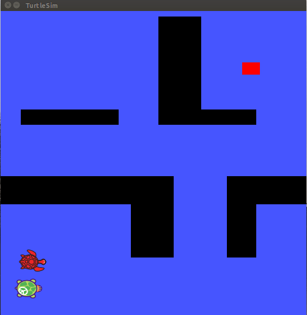
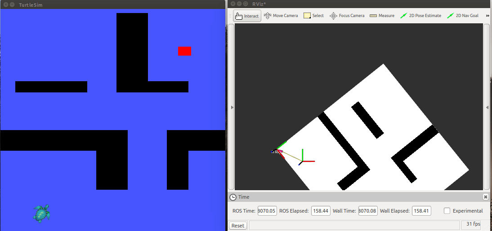
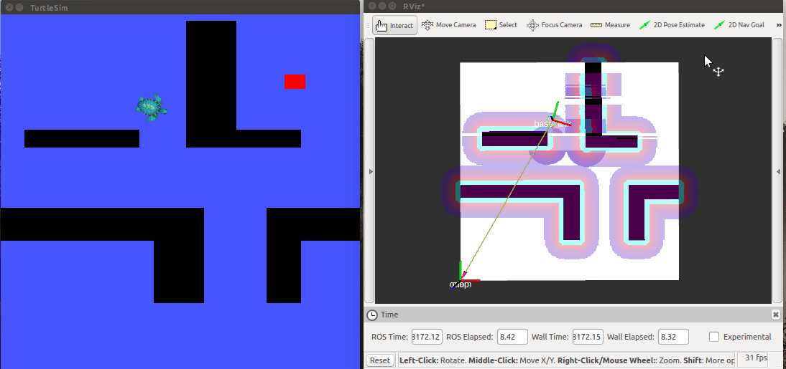

# turtlesim_examples
A node and launch files to make ROS turtlesim do navigation (fake laser, fake bumber, draw a map)


## Dependencies

- It doesn't depend on any package, only the packages that comes already with a full 
ROS installation. It was tested on ROS kinetic.

- If you want to run the ```movebase``` launch file to bring up the navigation stack, you need to install it first:
```
sudo apt-get install ros-kinetic-navigation*
```
## Examples

#### Example 1, turtle with fake bumber (a second turtle act as a bumber):
```
roslaunch turtlesim_examples bumber.launch
```



#### Example 2, turtle with fake laser scanner:
```
roslaunch turtlesim_examples laser.launch
```




#### Example 3, Bringing up navigation stack on the turtle:
```
roslaunch turtlesim_examples laser.launch
```
```
roslaunch turtlesim_examples moveBase.launch
```


